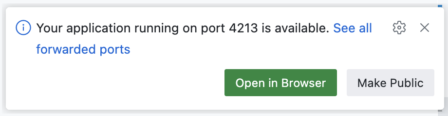

# Ratio PBC dbt Template

This is a basic repo that will help you get set up to develop a dbt project using the tools we normally use.

## Setup steps

1. Install [mise](https://mise.jdx.dev) for your operating system
1. Clone this repo.
1. Set `$MISE_ENV="windows"` locally in terminal or globally in environment variable manager if you are on Windows.
  * You may also need to manually run `mise activate pwsh | Out-String | Invoke-Expression`.
1. Run `mise dr` to make sure mise is correctly setup. If you do not get "No problems found", follow the suggested actions until you do.
1. Run `mise install` to install tools like Python, uv and duckdb.
1. Run `uv run main.py` and you should see "Hello from Ratio!".
  * If this fails, try `uv sync` or `mise activate pwsh | Out-String | Invoke-Expression`.
1. Run `dbt --version` and you should see dbt version information.
1. Run `mise run db:get`
1. Run `dbt debug` and you should see "All checks passed!".
1. Process `raw_data/fips.txt` into a CSV seed file with `fips_code,jurisdiction` as the header. It's OK to do this manually.

### GitHub Codespace

1. `curl https://mise.run | sh`
1. `echo 'eval "$(~/.local/bin/mise activate bash)"' >> ~/.bashrc`
1. Close that terminal and open a new one
1. Follow along above from the `mise dr` step.

## Raw Data

- `raw_data/fips.txt` is from the [FCC](https://transition.fcc.gov/oet/info/maps/census/fips/fips.txt), though it takes a long time to load.
- [Synthea Sample Data - April 2020](https://synthetichealth.github.io/synthea-sample-data/downloads/synthea_sample_data_csv_apr2020.zip)
- [CMS Medicare Claims Synthetic Public Use Files](https://www.cms.gov/data-research/statistics-trends-and-reports/medicare-claims-synthetic-public-use-files)

## Interview Hints

- You are not expected to look at the data before the interview.
- You will not need to use all of the tables in the `raw_*` schemas.
- `main` is the default schema in DuckDB.
- `duckdb dev.duckdb -ui` will open the database both at the command line and in a browser UI.
  - Click "Open In Browser" 
  - See [this post](https://duckdb.org/2025/03/12/duckdb-ui) for details on the DuckDB UI.
- If you're curious about the setup steps, you can view the `mise` tasks in the `mise.toml` file.

> [!NOTE]
> duckdb really only allows a single connection, which can be a bit of a pain. If you have a CLI or UI session open, you will want to close it with `.quit` first before you run `dbt build`, et al.

## Help

If at any point you need help getting set up, please don't hesitate to ask!
You can create an issue and tag @jc00ke on it, or send Jesse an email: jesse@ratiopbc.com.
